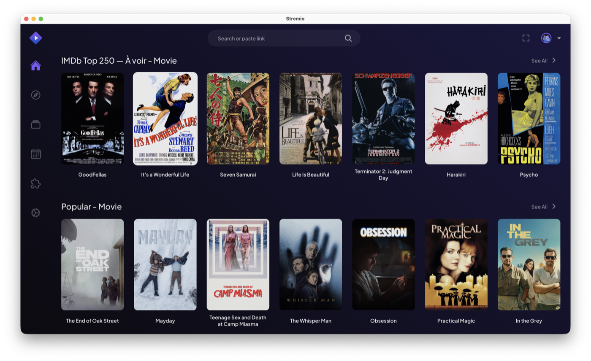
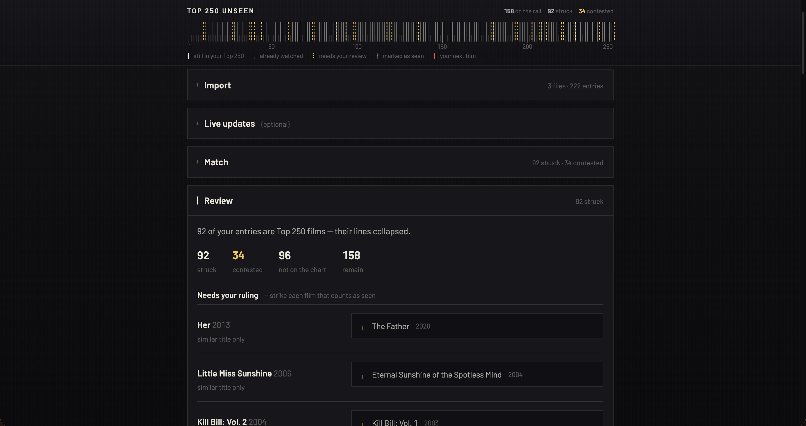

# Top 250 Unseen

[](https://github.com/matteopollet/stremio-top250-unseen/actions/workflows/ci.yml)

A Stremio addon that adds one catalog to your home screen:

> **IMDb Top 250 — À voir** = the current IMDb Top 250, *minus the films you have already seen* (according to Letterboxd), in IMDb rank order.



Open Stremio → the first film in the row is the highest-ranked film you haven't watched yet. Click it, watch it, log it on Letterboxd (or tick it in `/configure`), and it disappears from the catalog.



```
IMDb Top 250  ──┐
                ├─►  filter  ──►  Stremio catalog (rank order preserved)
watched films ──┘
(CSV export + RSS)
```

## Quick start

### Option A — hosted instance (no setup)

Open **https://stremio-top250-unseen.matteopollet.workers.dev/configure**, drop
your Letterboxd export files, click **Confirm & install**. Your CSV is parsed in
your browser — only a list of IMDb ids reaches the instance (see *Privacy*
below). Prefer your own deployment? Self-host with one of the options below.

### Option B — Cloudflare Workers (free, always on)

Recommended for self-hosting: the free tier (100k req/day, KV) is plenty and the
worker never sleeps.

```bash
git clone https://github.com/matteopollet/stremio-top250-unseen.git
cd stremio-top250-unseen
npm install
npm run build:configure
npx wrangler kv namespace create CACHE   # paste the ids into wrangler.toml
npx wrangler deploy
```

Then open `https://<your-worker>.workers.dev/configure`, drop your Letterboxd
export files, and click **Confirm & install**.

### Option C — Docker (self-hosted)

```bash
docker compose up -d
# open http://localhost:7146/configure
```

Or persist a watched export without the browser flow:

```bash
docker compose exec addon sh -c 'node dist/cli/import-watched.js /export/watched.csv'
# simplest: put the CSVs on the host and use the local flow below
```

### Option D — Local Node

```bash
npm install && npm run build:configure
npm run import-watched -- ~/Downloads/letterboxd-*/watched.csv   # one-time baseline
npm run dev                                                     # http://localhost:7146
```

Then install `http://localhost:7146/manifest.json` in Stremio (desktop app only —
remote apps require HTTPS).

> Note: http/LAN installs work in Stremio desktop and Android; `web.stremio.com`
> and TV apps need an HTTPS URL — that's what Option A gives you.

### Moving the catalog up your home screen

Stremio orders home rows by addon installation order — nothing in the addon
protocol controls position. To move this catalog up without reinstalling
everything, use the community [Stremio Addon Manager](https://stremio-addon-manager.pages.dev/):
log in, drag the addon where you want it, click *Sync to Stremio*.

## How "watched" is determined

Three complementary sources, unioned:

| Source | Role | How |
|---|---|---|
| **Letterboxd CSV export** | canonical baseline | `watched.csv` + `ratings.csv` + `diary.csv` (+ `reviews.csv`), matched **in your browser** (or locally via CLI) — only the resulting list of IMDb ids is stored on your instance. Other export files (`watchlist.csv`, likes, lists…) are ignored on purpose |
| **Letterboxd RSS** | opportunistic delta | `/​{user}/rss/` gives each logged film's TMDB id → resolved to IMDb ids (Wikidata batch, TMDB fallback) and **accumulated** server-side |
| **Manual checklist** | instant override | `/configure` lists the Top 250 films still visible in your catalog — tick the ones you've seen and they disappear immediately. Stored separately (`manualExclusions`), so a CSV re-import never wipes them |

Honest caveat about the RSS path: Letterboxd regenerates feeds on its own
schedule (observed lag: up to ~1h) and films you merely mark with the eye icon
— without a diary entry or review — may not appear in it at all. Logging or
rating a film is picked up automatically once the feed refreshes; for anything
else, use the checklist or re-drop the CSVs in `/configure` — it takes ten
seconds. Reopening `/{cfg}/configure` (bookmark it after install) reloads your
saved exclusions so you can just tick films without re-uploading anything.

### Privacy

Your Letterboxd export is parsed and matched **entirely in your browser** (or
locally by the CLI). The server only ever receives a list like
`["tt0111161", "tt0068646", …]` — the Top 250 films to hide — plus the handful
of rows it couldn't confidently identify, for the status page. Your full watch
history never leaves your machine. Each deployment is *your* instance; there is
no central service.

### Matching is conservative on purpose

Only ~250 candidates matter, so matching is *precise, not clever*:

```
exact IMDb id → normalized title + exact year → ±1 year for exact/contained titles
→ curated alias table → TMDB resolution → if in doubt: keep the film
```

A false negative (a seen film stays visible) is mildly annoying; a false
positive would silently remove a film you'd never know you missed. Doubtful
rows are listed in `/{config}/status.json` and can be pinned via
`data/aliases.json` or per-config `forceInclude`/`forceExclude` overrides.

### Troubleshooting

- **A film you just watched is still in the catalog** — the RSS feed refreshes
  on Letterboxd's schedule (see the caveat above). Tick the film in the
  `/configure` checklist for immediate effect, or re-drop the CSVs.
- **The RSS delta does nothing at all** — your Letterboxd profile must be
  public. Check `/{cfg}/status.json` → `watched.errors` (a private profile
  yields `letterboxd rss: HTTP 404`).
- **Something looks stale or off** — `/{cfg}/status.json` reports which chart
  source served (`imdb-graphql` or `snapshot:*`), whether it is stale, the
  exclusion counts and any provider error.
- **Self-hosted env mode**: `/configure` always produces a `/{cfg}/manifest.json`
  URL — install that one. The bare `/manifest.json` reflects only the
  exclusions written by `npm run import-watched` (the shared `default` scope
  is intentionally not writable over HTTP).

## Endpoints

| Route | Purpose |
|---|---|
| `/{cfg?}/manifest.json` | Stremio addon manifest |
| `/{cfg?}/catalog/movie/top250_unseen.json` | the catalog (supports `skip=N` pagination) |
| `/{cfg?}/configure` | configuration page (browser-side CSV matching + seen checklist) |
| `GET /{cfg?}/exclusions` | the stored exclusion set (used to prefill `/configure`) |
| `POST /{cfg?}/exclusions` | stores `{excludedImdbIds, manualExclusions, ambiguous}` under your storage key (required — an unguessable ≥16-char token generated by `/configure`; anonymous writes are rejected); omitted fields keep their stored value |
| `/{cfg?}/chart.json` | the raw ranked chart + aliases (public data) |
| `/{cfg?}/status.json` | freshness, exclusion counts, ambiguity report |

`{cfg}` is a base64url-encoded JSON config generated by `/configure`
(Torrentio-style). Without it, the `.env` / env-var config applies.

## Configuration

| Key | Env var | Notes |
|---|---|---|
| `letterboxdUsername` | `LETTERBOXD_USERNAME` | enables the RSS delta; public profile required |
| `tmdbApiKey` | `TMDB_API_KEY` | optional; only used when Wikidata misses an id. Heads-up: the key travels inside your addon URL — anyone you share that URL with can read it. On Cloudflare, prefer `npx wrangler secret put TMDB_API_KEY` over a plaintext `[vars]` entry |
| `storageKey` | — | generated by `/configure` (unguessable token); scopes your stored exclusions. The shared `default` scope (env mode) is only writable via the CLI |
| `catalogName` | `CATALOG_NAME` | catalog display name |
| `overrides` | — | `{forceInclude: ["tt…"], forceExclude: ["tt…"]}` |
| — | `TOP250_SNAPSHOT_URL` | replace the chart source entirely |
| — | `DATA_DIR` | writable state dir (Node runtime), default `data/local` |

## Data sources & ToS

Honest status, since this project aggregates third-party data:

- **IMDb Top 250** is fetched live from IMDb's internal GraphQL endpoint
  (`api.graphql.imdb.com`, `chartTitles / TOP_RATED_MOVIES`). It is
  **undocumented and unofficial** — the response itself carries IMDb's
  "limited non-commercial use" disclaimer. It may break without notice, which
  is why a dated snapshot ships in `data/top250.snapshot.json` (refreshed
  weekly by CI, best-effort) and `TOP250_SNAPSHOT_URL` lets you point at any
  source. The `ChartProvider` interface makes the source replaceable.
- **Letterboxd**: no public API exists and scraping is prohibited by their
  ToS, so this addon uses only the *official CSV export* (your own data) and
  the *public RSS feed*. No scraping, no credentials.
- **Wikidata / TMDB** are used only to translate TMDB ids → IMDb ids. TMDB is
  free for non-commercial use and requires attribution: *this product uses
  the TMDB API but is not endorsed or certified by TMDB.*

## Development

```bash
npm test              # vitest — matcher, csv, rss, catalog, http
npm run typecheck     # node target
npx tsc -p tsconfig.worker.json   # workers target
npm run build:configure           # rebuild public/configure.js (committed)
npm run refresh-snapshot          # update data/top250.snapshot.json
```

Layout: `src/core/` is runtime-agnostic (no `node:*` imports — it also runs in
the browser bundle and in Workers); `src/http/` implements the Stremio
protocol; `src/runtime/` holds the thin Node/Workers adapters; `src/cli/` the
import/refresh scripts; `data/` bundled reference data.

## Roadmap

Non-goals for v1, enabled by the provider interfaces: Trakt/Simkl watched
providers (`WatchedProvider`), other ranked charts or lists (`ChartProvider`),
series support.

## License

MIT
